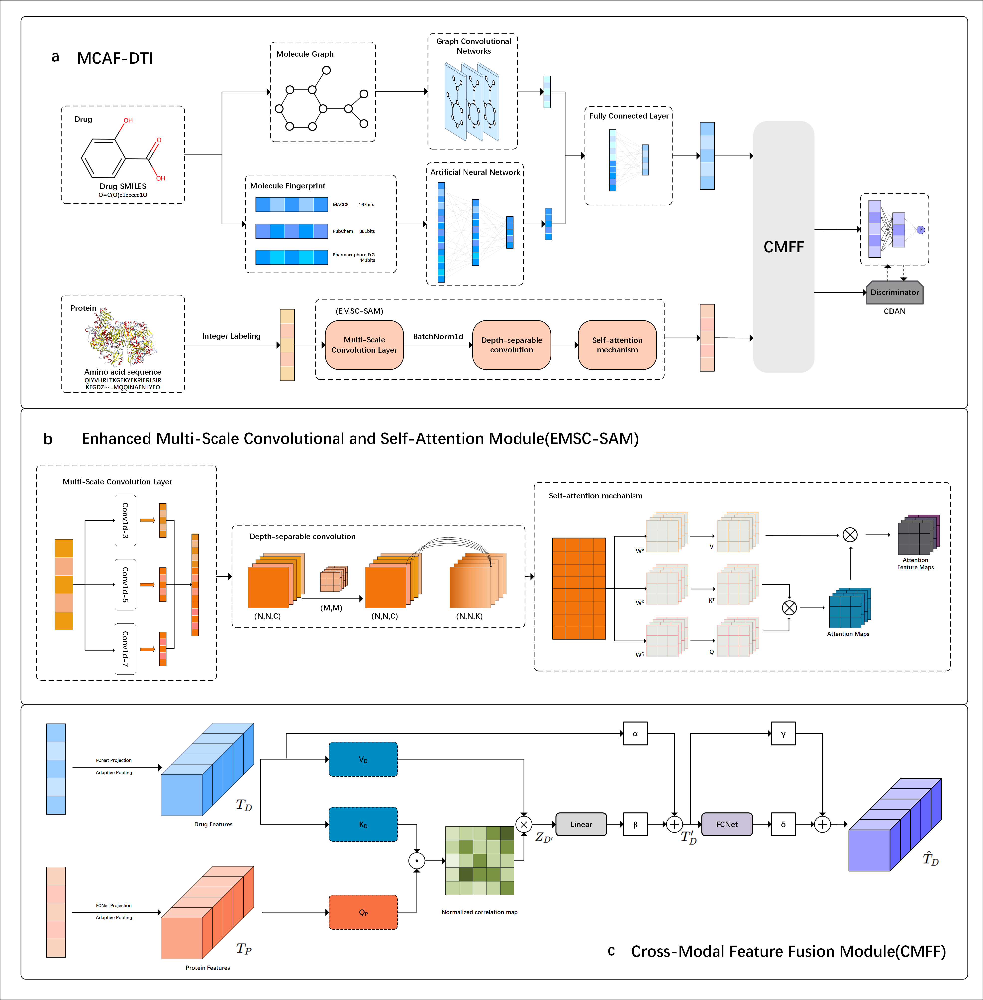

# MCAF-DTI: Multimodal feature fusion interactive networks for drug target interaction prediction 


## Framework


## System Requirements
The source code developed in Python 3.8 using PyTorch 2.3.1. The required python dependencies are given below. 

```
torch==2.3.1             
torchvision==0.18.1      
torchaudio==2.3.1         
torch_geometric==2.5.3    
dgl==2.0.0+cu121          

numpy==1.24.3           
pandas==2.0.3          
scipy==1.10.1         
scikit-learn==1.3.2    


opencv-python==4.10.0.84 
pillow==10.4.0           
matplotlib==3.7.5         

tqdm==4.66.5             
requests==2.32.3          
rich==13.8.0           
yacs==0.1.8              
rdkit==2024.3.5         
```


## Run MCAF-DTI


 Execute the following command to train the MCAF-DTI model. `dataset` could either be `bindingdb`, `biosnap` and `human`. 
```
python main.py --cfg "configs/MCAF.yaml" --data dataset 
```


